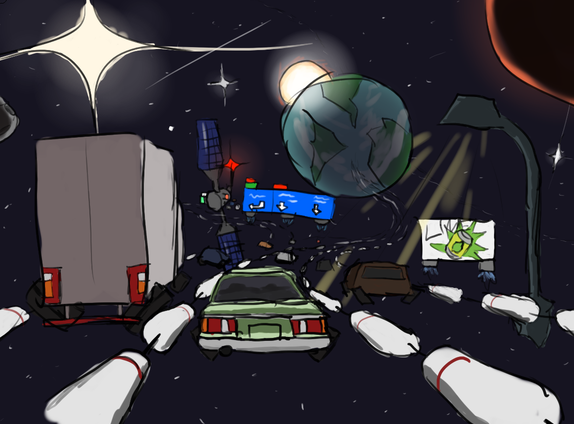
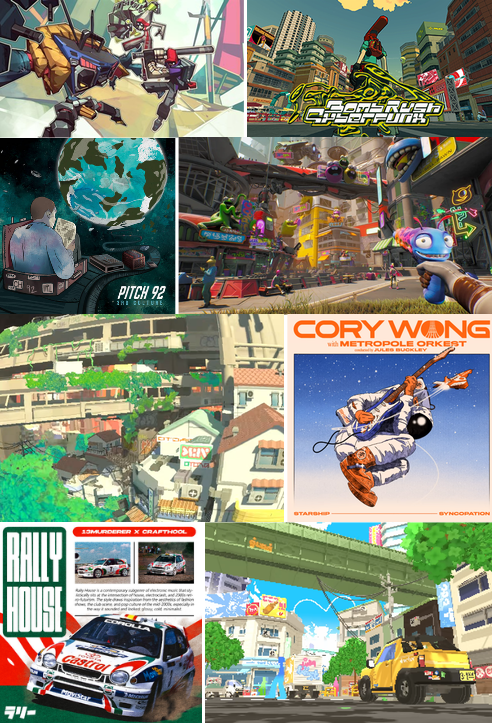

- [Versions - notes and descriptions](#versions---notes-and-descriptions)
  - [v0.2.3](#v023)
    - [IMPORTANT Note](#important-note)
    - [Brief](#brief)
  - [v0.3](#v03)
- [Gameplay Pitch](#gameplay-pitch)
  - [The love for multiplayer FPS](#the-love-for-multiplayer-fps)
  - [The frustration of mutliplayer FPS](#the-frustration-of-mutliplayer-fps)
  - [So what if an entire game was built around creating those moments ?](#so-what-if-an-entire-game-was-built-around-creating-those-moments-)
  - [The promise](#the-promise)
- [Artistic Direction (snippets)​](#artistic-direction-snippets)
  - [Visuals​](#visuals)
  - [Music](#music)
  - [Background​](#background)

**Versions** briefly presents the available versions that you can play.  
**Gameplay Pitch** presents the intention, the pitch of the game, from a pure gameplay perspective.  
**Artistic Direction** presents snippets of ambience/world building/AD related development.

# Versions - notes and descriptions

## v0.2.3

Currently, only v0.2.3 is available. It is a very early prototype of the very fundamental aspects.

### IMPORTANT Note

Please, be gentle on the server, and don't share this project to anyone. This is an extremely early PoC, so the server holding scores is completely home made, on a poor retired rack thinkpad.

No domain-specific security has been developped, so it is absolutely not cheat proof.
It's also not going through any specific VPS, so it won't filter much trafic, it only handles base privacy and exchange security through [caddy](https://caddyserver.com/).

Please don't DDOS :D  
...  

Please D:

### Brief

You have 80 seconds to score as much as possible in a little arena sand pit.  

Use covers and stay in movement to mitigate the damages you take.  
Use the right weapons, depending on your own skills and on the enemies.  
Manage your amunitions, and try to take advantage of the power ups.

**You**

*Survive with*
- **Shield** (blue) that regenerates after a short time without taking damage
- **Flesh** (white) that will never regenerate, so be carefull !

You lower the accuracy of the enemies by moving fast (relative to their vision, run straight to them and they'll cook you like a chef).  

If your flesh reaches 0, game over.

*Fight with*
- The **P3-W**, a revolver-like gun of 8 shells, with no ADS, that goes pew.
- The **G0Z-BRT**, an smg-like gun with an ADS, a small loaded capacity, but very high DPS, that goes brrt. 
- Your **Fists**, that allows you to move slightly faster, can't headshot but do critical damage in **backstab**, can be held down to deal heavier hits.
Besides, hits transform in a propulsing uppercut if you have vertical momentum when hitting your target (for example, by uncrouching and jumping !)

*Move with*
- **Crouched**, **running**, and **sprinting** movements, that all benefit from the **quake/source like** physics, allowing you to performs movements techs such as circle jumps.
- A **slide**, that can be performed by crouching with enough speed, and provides a speed boost.
- **Wall bouncing**, performed in a similar fashion to apex.
- **Wall climbing**, performed by holding space bar while moving towards a wall, which force scales with your entering momentum.
- **Ledge climbing**, that can connect into a **ledge vault** by pressing crouch in a few milliseconds before completing the climb, to preserve and build up momentum.
- A fine-tuned source-like **air straffing**, that allows you to build up momentum in air, and get much more air control, if you master it.

*Move with (omni version, some abilities that cost a charge)*
- **Dash**, that makes you cross a few meters quickly, but also redirects your momentum, and passes through enemies (eh, do you smell that connection with the backstab mechanic ?)
- **Propeller**, that provides a kind of double jump, but slightly slows you down.
- **Slam**, that allows you to quickly redirect your momentum downward, like a fast fall.
- **Lurch**, that is essentially a cheap dash, that only redirects your momentum without providing an actual dash.

There's many more subtleties, interconnections, and resulting movement techs to that system, that I might detail in a little movement guide for true sweats and nerds.

**Pickups**

You can find amunitions pickups to refill
- your **burst weapon** (P3-W) amunitions (orange)
- your **continuous weapon** (g0Z-BRT) amunitions (purple)
- the weapon you're currently holding (blue)

Two special power ups also spawns during the run
- The holy quake 3 **quad-damage**, that, uh, triples damage (a lost relic of quake 1 & 2)
- The **lime juice**, that slows time for a bit

**Enemies**

Some have
- **Armor** (orange) weak to burst damage
- **Barrier** (purple) weak to continuous damage
- **Flesh** (white) which is simple health.

As well as more or less erratic movements, and different health pool.

**Others**

Can try to beat your score !

You can indeed register an account, and play under it to register your scores, improve them, and try to take over the leaderboard.

In the leaderboard, you'll find detailed description of how each player reached his score, which weapons he used, accuracy, etc.

## v0.3

v0.3 is currently in development, release coming soon !

It will try to explore a bit map design, and provide the very first bare sense of rythm, by pushing the player to perform rotations, in a very rudimentary way, notably to expose the movement system to a more realistic environment than the simple arena pit.

# Gameplay Pitch

Thirst for Lime is, first of all, not really a boomer/movement shooter, but much more specific.

As a one liner - It is the skatepark of the FPS genre. A skill sport disguised as a shooter.

## The love for multiplayer FPS

Multiplayer FPS are the playground for the most legendary moments of mechanical expression.

This game where everything clicks: your aim is locked in, every movement is intentional, you pull off crazy movement techs, for the right situations, breaking your opponents ankles. You know their every moves, and even when threats are appearing faster than you can consciously process them, your subconscious handle them effortlessly.

## The frustration of mutliplayer FPS

In multiplayer games, these moments are accidental, overshadowed by strategy, teamwork and balance (should i say, bALaNCe *cough*). You keep clicking that play button, hoping for the 1 in 100 game that is chaotic enough, on the right map, with the right enemies and the right team mates.

Aim trainers isolate a part of the experience in a stimulating, mechanically dense and super competitive environment. But fps fundamental mechanics are much richer than just aim, it is also about movements, target acquisition, positioning, tempo, and other split-second decision making.

Finally, fast paced single-player shooters offers a great environment, but they usually develop their fun through very game-specific systems, so specific than fundamentals usually don't matter much anymore. You don't get good at ultrakill by being the god of FPS, you get good at ultrakill by being good at ultrakill, specifically.

## So what if an entire game was built around creating those moments ? 

A solo competitive shooter built around the infinite pursuit of mechanical mastery. A game that gets inspiration from the conventions, juice, intensity and complexity that makes multiplayer fast fps so satisfying, and pushes it to the next level by leveraging the game design freedom we get from leaving the multiplayer constraints.

A game for players who love spending hours practicing, almost rewiring their brains with automatisms.

## The promise

Think of skateboarding, juggling, bouldering, calisthenics, but it's an FPS .. This sensation of developping something, not out of knowledge, but out of your brain and hands, to start to feel the things.

And when it comes to games, think of rocket league, apex if it was an arena shooter for its crazy movement depth, but also ​rythm and racing games in general.

You don’t finish it, you practice, you improve, and you express your mastery.

That’s the game.

The self-improvement incentivised, mechanically focused environment of aim trainers, but not isolated to aim.

The rich mechanical expression, intensity, complexity and gameplay depth of multiplayer FPS, but with a saner competitive environment, and without the constraints of balance and teamwork.

The fun, gamified, design freedom of solo FPS, without overshadowing the fundamental mechanics.

# Artistic Direction (snippets)​

The game could seem very gameplay oriented from the prior description, and it is.

It would not especially benefit from a dense background and universe. Yet, it’d be even more interesting if it wasn’t just a shoot and run thing. Let’s take the opportunity to have fun writing, dreaming and expressing something a little more meaningful.

So in this section, I'll discuss the bare snippets of the artistic direction I started to explore.

The game takes place in a pseudo-utopian, absurd, punky/scrappy future.

## Visuals​

The artistic direction should tend towards something very bright and colorful, quite absurd. 

A little reference bank is forming, and it finds its biggest influence in diverse forms of street art, but also a bit of 70s retro-futurism, 90s and 2000s.

For games, it typically find its reference in games like bomb rush cyberfunk, borderlands, etc.

This little draft of an artwork from a totally artistically incompetent person that is me already encapsulates some ideas. Representing "inter-spatial highways" as litteral highways separated by pool lane lines, with modified 2000s cars cruising in.

Quite absurd, but I like the idea of building a super futuristic universe with the more carefree, imperfect, scrappy and intimate mood of the 90-2000s. Not only I like it and want to explore it, but it wonderfully serves the message and background of the game, discussed below.

​​​

Below is a very brief little ""moodboard"", that will probably be later updated to a better fitting one !

​
## Music

When it comes to music, the dominant reference is oldschool boom bap.

Think about Pitch 92, Unreasonable Doubt from Jay-Z, It Was Written from Nas, The awakening from lord finesse, Unlocked from Denzel curry, MF Doom of course, to only cite a few.

The other major influence is jungle, other related oldschool DnB derivatives, as well as somehow related house genres like your typical “rally house”.

But truly, the influences are very diverse since the general intention is to capture this 90-2000s feel.

It extends to some jazz, funk, house, neurofunk, and even pop references.

Yet, boom bap would be the dominant influence, the one that best serves the purpose and philosophy of the characters we will mainly follow - carefree goofy rebels tryna find fun and purpose in their sluggish life.

Another reason why it is a great influence, is that it is the opportunity to build the background in a more organic way. The idea of writing fictional rap that directly tells us about the mentality of the living generation of this world. It makes it more believable, more lively. Plus, it is quite a fun writing exercise, that I already did spend a bit of time on.

The music won’t have a strong gameplay-related purpose, but it is still quite important as it is a major piece for building this atmosphere.

## Background​

Here, spatial exploration has reached new bounds, extending to a significant part of the galaxy, and optimists even dream about reaching other ones in the near future.

This opened us to abundant resources. Technology, science and health has skyrocketed, to an extent where a gunshot wound is as bad as a crooked nose, and where working has become secondary. 

The system has been unified in the past years, and everyone is entitled for a universal basic income. Some still work, sometimes because that basic income is minimal, enough to live a decent life, but not if you have more ambitions or greater dreams, sometimes to give a purpose to their life, some others simply out of nostalgia of the old world, because they just can’t get used to this new one. This builds into a stable balance where there’s just enough workforce for the system to prosper.

But, behind the scenes, a sense of unease pervades a large portion of the population. This brutal change of paradigm has left many lost, questioning the meaning of their existence in this paradoxical system. What initially was a sense of relief, turned for some into a general lethargy.

Besides, since work has become much less necessary, it also became much rarer. And those who, despite this lethargy feeling, retained a sense of effort and ambition, struggle to find the opportunities, particularly in some remote systems, and must resign themselves to what sounds like a life that has been chosen for them.

In a world where billions of ships travel through the inter-spatial highways everyday, crossing countless worlds and planets, where seeing the true face of the universe has never been more accessible, it is especially frustrating to feel trapped, condemned to slowly grow old and die in the very place you were born, bound to the same routine for a lifetime.

The dream of a brighter future, one of freedom and possibilities, seems to have faded behind this veil of security and simplicity. Happiness does not arise from fulfilled needs, but from the pursuit of identity and meaning. Many feel that both have been taken from them.

It is a quiet, underlying malaise, yet in truth most people live through this age without such troubling thoughts. Though few would describe themselves as truly happy, many have simply accepted that this is the world they inhabit—that they lack the power to change it, that they have no legitimate claim to do so, or sometimes that attempting to reshape everything once again would be far too dangerous. The cost, they believe, would be too great. After all, everyone can live comfortably; why concern oneself with anything more?

What is certain, however, is that those afflicted by this unease never find answers among those who have accepted the world as it is. Instead, they are left with the growing conviction that they are misunderstood, and later, that the others have simply chosen to forget—to ignore the sickness, to keep their eyes fixed upon the shadows on the wall of the cave.

And so, some begin to rise.

So behind the facade utopia, it seems there’s a dystopia, but that’s not really what is being buildt here. All this uneasy climate is at the very deep bottom, the world really is more of a utopia than a dystopia. People are pretty free, the global ambience shall remain bright, and not so serious. It is just interesting to discuss and explore something about what meaning truly is, and contemporary social malaises our generation feel and exchange, reframing them in a more optimistic and carefree universe. 