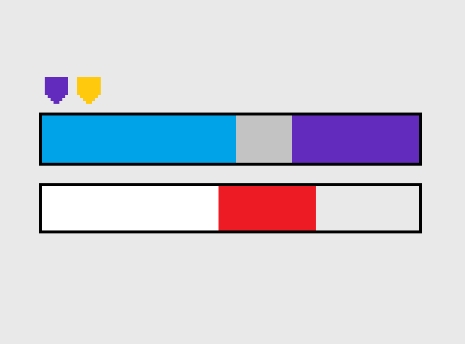
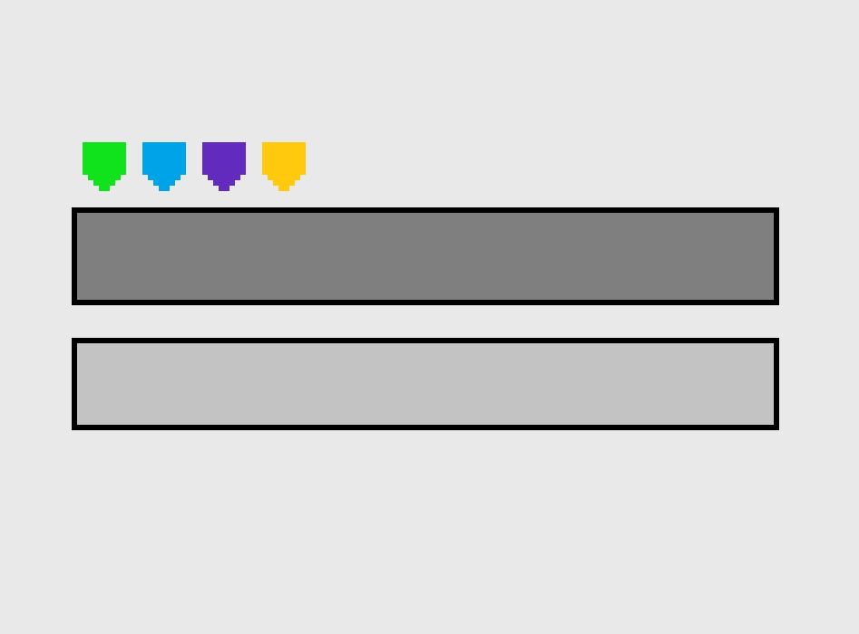
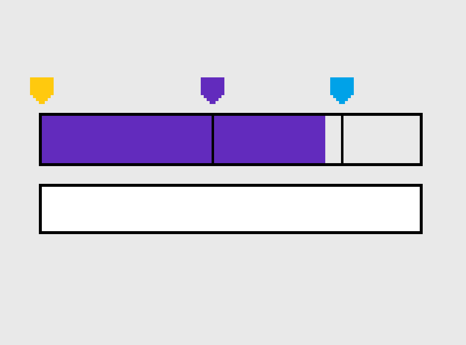

A quick discussion on how health will be implemented in the game.

**Table of Content**
- [Health pools](#health-pools)
- [General game feel](#general-game-feel)
  - [Simple layout approach](#simple-layout-approach)
  - [Two other approaches](#two-other-approaches)
- [Basic Health pool](#basic-health-pool)
  - [Healing](#healing)
    - [Player](#player)
    - [Ennemies](#ennemies)
- [Armor](#armor)
  - [Game Design](#game-design)
  - [Algorithm](#algorithm)
    - [Constant Reduction](#constant-reduction)
    - [Linear Reduction](#linear-reduction)
    - [Linear Resistance](#linear-resistance)
  - [Game feel](#game-feel)
- [Barrier](#barrier)
  - [Game Design](#game-design-1)
  - [Algorithm](#algorithm-1)
    - [Cooldown based barrier](#cooldown-based-barrier)
    - [Linear Reduction and Linear Resistance](#linear-reduction-and-linear-resistance)
  - [Game Feel](#game-feel-1)
- [Shield](#shield)
  - [Active Shield](#active-shield)
- [Overshield](#overshield)
  - [Algorithm](#algorithm-2)
  - [Game Design](#game-design-2)
  - [Game Feel](#game-feel-2)
- [Plating](#plating)
  - [Algorithm](#algorithm-3)
  - [Game Design](#game-design-3)
  - [Game Feel](#game-feel-3)

# Health pools

The different health pools are as follows. The lower in the list is the highest priority in damage intake.
- **Basic Health pool** - Simple health.
- **Armor** - Weak against burst damage, strong against sustained damage.
- **Barrier** - Weak against sustained damage, strong against burst damage.
- **Shield** - Simple health that can regenerate over time. (or maybe more, read the [shield](#shield) section)
- **Overshield** - A temporary pool of simple health that cannot be restored, and comes from pick ups or abilities.
- **Shell** - A simple health pool that can't be peirced through, and makes its owner immune to any negative effect, such as slow, weakening, etc.

An **Entity** is dead when its lower layer of health is 0. In most cases, it would be the **Basic Health pool** but it isn't necessary the case.  
If an entity has no starting basic health, yet has Armor, then only this layer would determine if the entity is dead or alive.

**Ennemies** can have any combination of health pool, and can also have **plating**.  
It decreases the overall damage intakes, but can be reduced or broken with special abilities or weapons.  

**Player** has Basic **Health** and a little pool of **Shield**. Through pickups or abilities, he can also obtain ***Overshield**.

It could be interesting to make Shield specific to the player instead, making it clearer, and the shield would be the player's equivalent of the ennemie's barrier, in a diegetic approach.

# General game feel

Each layer of health could have
- a slight variant of the hitmarker sound
- a sound on layer breaking
- a specific health bar color

| Layer  | Body Color               | Tail Color           | Heal color |
| ------ | ------------------------ | -------------------- | ---------- |
| Health |  |  |  |
| Armor |  |  |  |
| Barrier |  |  |  |
| Shield |  |  |  |
| Over Shield |  |  | None |
| Shell |  | None | None |

## Simple layout approach

We could have two health bar to display, the lower layer, and then a bar for all the higher special layers, each layer stacking on the lower one. We could also add a small icon on top of this bar to indicate which layers this entity has left.  

The carapace would take the entire bar space, until it is broken.

## Two other approaches

Many health bar layers like this might not be so intuitive.

One first other approach is to still have two health bars, one for the lower layer of health, and one for the others. But instead of stacking layers on on to the other, it would be one unique layer, which change colors depending on the currently exposed layer.

One last approach would be to display it with a simple icon and on hit.

The color of the hitmarker, or the damage indicator, would change when the damage pool is *resisting* to the type of damage you are inflicting.

For example, if you shoot with a burst weapon on a barrier pool, the damage indicator would turn purple.

 
 

# Basic Health pool

It is the last possible layer of health.

## Healing

### Player

To heal its health pool, the player must pick up some health packs, and use them.  
The healing process would take a few seconds, and doing so, the player's move speed would be slightly reduced plus he might not be able to sprint.

Some abilities would also heal the player.

### Ennemies

There might be healers ennemies, which heals their allies, which could be some priority targets.

 
 

# Armor

## Game Design
Armor incentivize the player to use burst weapons, towards the use of his dynamic clicking technique.  
It could be interesting to have it vary, simply keep the core principle of making it stronger against sustained damage, but allow the specifics about it to vary from one ennemy type to another.

We could set how strong and what threshold the armor has. Meaning how much it can reduce the damages, and what is the burst threshold.

## Algorithm
There are mutliple solution to this idea.

### Constant Reduction

[Desmos Visualization](https://www.desmos.com/calculator/p9je6b1tga?lang=fr)  
The simplest solution is to define reduction as a `resistance` % which is capped by a `max_reduction`.  
- `resistance` is the intended % of resistance.
- `max_reduction` is the maximum damage reduction that can be applied.

It means once the max reduction is passed, the higher the damage, the lower the **effective** resistance %.

The computation would be :
- `reduction = min(damage * (resistance), max_reduction)`
- `final_damage = damage - reduction`.

### Linear Reduction
[Desmos Visualization](https://www.desmos.com/calculator/9zipgr6vby?lang=fr)
A more complex idea, is to set a `maximum_resistance` %, a `minimum_threshold` and a `maximum_threshold`.
- `maximum_resistance` is the % of reduction at the best effectiveness of the armor.
- `minimum_threshold` is the minimum amount of damage for the **effective** resistance to start decaying below `maximum_resistance`.
- `maximum_threshold` is the mimimum amount of damage for the **effective** resistance to be 0.

Now, the reduction linearly decreases from `minimum_threshold` to `maximum_threshold`, from 0 to `maximum_resistance`, which might be more flexible and easier to balance, but it might also be a little less intuitive.

The computation would be :  
Compile time -
- `a = (maximum_resistance * maximum_threshold) / (minimum_threshold - maximum_resistance)`
- `b = -a * minimum_threshold`  

Run time -
- `reduction = clamp(a * damage + b, 0, maximum_resistance * damage)`
- `final_damage = damage - reduction`

### Linear Resistance

[Desmos Visualization](https://www.desmos.com/calculator/orecuaomyh?lang=fr)  
Based on the previous idea, but here, we are not linearly decreasing the reduction, but the resistance.

The computation would be :  

Compile time -
- `a = maximum_resistance / (minimum_threshold - maximum_resistance)`
- `b = -a * maximum_threshold`  

Run time -
- `resistance = clamp(damage * a + b, 0, maximum_resistance)`
- `reduction = damage * reduction`
- `final_damage = damage - reduction`

## Game feel

Diegetically, armor are hard magnetic reactant, like translucid metal plates. Its rigidity allows to isolate its owner from moderate impacts. However, it can be pierced through with a violent and precise impact.

material ref - metal and glass

# Barrier

## Game Design
Barrier incentivize the player to use sustained damage weapons, towards the use of his tracking technique.  

Just as for the armor, we could set a strength to it, and a threshold, at which damages are considered burst damage.

## Algorithm

### Cooldown based barrier
[Desmos Vizualisation - x axis is the number of shots per seconds](https://www.desmos.com/calculator/ruvsgwb5vx?lang=fr)  
One first idea is a time-based barrier. We have a minimum amount of time between two damage reduction, and a reduction amount, either % or flat, or both.
We keep track of the last time we did reduce the damage using the barrier, and if it is too soon, the damages are inflicted directly.

**Example**  
If the barrier has a cooldown of 1 second, and 100% resistence, a weapon which shoots 100 shots/seconds for 1 dmg each will deal 99 damage.  
The first tick is reduced to 0 damage, the 99 others are not reduced at all.  

However, a weapon which deals 1 shot/seconds for 100 dmg each will deal 0 damage.  
The first shot is reduced to 0, and before the next shot is available, the barrier will be ready again.

### Linear Reduction and Linear Resistance
In a more linear way, we could define it the same way we did for the Armor, but inverted.
- [Linear Reduction](https://www.desmos.com/calculator/5bqqsx4pka?lang=fr)
- [Linear Resistance](https://www.desmos.com/calculator/apfrfzjjvv?lang=fr)

## Game Feel
Diegetically, barrier acts like a wide magnetic field which cushions shock, just like a pillow. It excells at absorbing violent shocks, but can get overflowed by overwhelming signals, the magnetic field can't resets to its initial state fast enough.

material ref - magnets

# Shield

There are two possible approach with shield.

The one discussed above, the simple one, is for the shield to be a simple health pool that can regenerate.
However, another approach might be intersting.

## Active Shield

When it comes to the player's shield, we might use the shield as an ACTIVE shield instead of a PASSIVE one.  
Something similar to *Super Smash Bros* Shielding. The shield is unactive, unless the player press a specific input. While the shield is active, it slowly decays, but can absorb damages.

We might includes timing mechanics, for example, if the player start shielding right as he receives damages he can deflect the incoming damage. If he stops shielding right as he receives damages, the shield gets regenerated partially.

It sounds like a very cool idea but needs to be tested, it might be some uncessary additionnal inputs.

> More about absorbing on stop - we could set a time window, let's say 100 ms, and all the damages taken in the last 80 ms before releasing shield are restored to it, including overflowing damages. Should overflowing damages overflow on the health of the player ? It could be a nice reward to cancel any overflow.. Maybe, on shield break, the player would have a quick timing to release shield and get the absorption, or overflow cancel, or both..

# Overshield

## Algorithm
how it works, variable parameters ..

## Game Design
possible in game modification, influence ..

## Game Feel
discuss sounds, ui ..

# Plating

## Algorithm
how it works, variable parameters ..

## Game Design
possible in game modification, influence ..

## Game Feel
discuss sounds, ui ..