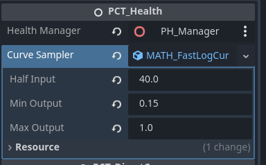

/[scripts](../../..)/[engine_tools](../..)/[math](../)/curve

---

This folder contains a generic curve sampler definition and various implementations to simplify common data transformations. For example, clamping input to a specific range and normalizing them to a different scale and distribution.

| folder (clickme)      | content abstract          |
|-----------------------|---------------------------|
| [float](float/)|Implementations for floating-point values. |

# Usage

The curve sampler are Godot resources, that you can easily create and attach to any Node.



Then, in-code, you can retrieve the transformed output by calling -
```cs
T input = ...;
T output = _curveSampler.Sample(input);
```