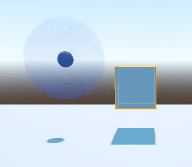
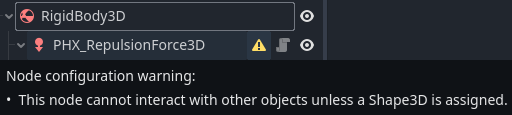
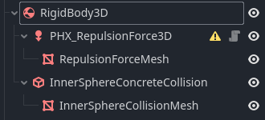

/[scripts](../../../..)/[engine_tools](../../..)/[physics](../..)/[bodies](..)/objects

---

This folder contains custom physics bodies implementation.

- [Repulsion Field 3D](#repulsion-field-3d)
  - [Usage](#usage)
  - [Clipping problem](#clipping-problem)
  - [Thorough documentation](#thorough-documentation)
    - [RepulsionStrength](#repulsionstrength)
    - [RepulsingCurve](#repulsingcurve)
      - [X axis](#x-axis)
      - [Y axis](#y-axis)
      - [SphereShape](#sphereshape)
      - [CollisionMask](#collisionmask)

# [Repulsion Field 3D](PHX_RepulsionField3D.cs)

A repulsion field for a ``RigidBody3D``. The repulsion field gets pushed back by other collision objects. The closer it is to another object, the harder it is pushed back. 

## Usage

To use it, you simply put this node as a child of a ``RigidBody3D``, and assign it a [repulsion force data](#thorough-documentation).

> You should ignore the alert about ``ShapeCast3D`` missing a given shape, as the ``PHX_RepulsionField3D`` will automatically fetch the shape assigned in its associated data at runtime.  
  
> This is done to force the use of a Sphere Shape, as ``ShapeCast3D``'s shape can be any kind of shape.  
> We could further define a more generic repulsion field, but there's no use for such for now.  
> 
> Current implementation of this isn't ideal, as the fetch is performed in Ready(). Editor changes at runtime will not be applied. It's a very low priority flaw considering the current usage of this object.

## Clipping problem

Repulsion forces might clip through geometry, as its purpose is not to give proper collision. If you don't want that to happen, you should pair the repulsion field to another concrete collision object, such as in the demo gif above, which is built with the hierarchy shown below.

## Thorough documentation

The only configuration required for a repulsion field is its data, defined as a resource in [PHX_RepulsionField3DData.cs](PHX_RepulsionField3DData.cs).

The exact way it works is it looks for any collision point in the radius of the field, with any object in the matching collision layers, and use the vector between the center of the repulsion field and the collision point as a repulsion force.  
The magnitude of this force vector depends on the repulsion strength, the distance between the collision point and  the center of the repulsion force, and the given curve sample.

### RepulsionStrength

Corresponds to the exact maximum strength applied to one repulsion force for one collision point. Where this maximum strenght is exactly applied depends on the [repulsing curve](###).

### RepulsingCurve

A curve which defines how the distance between a collision point and the repulsion field should affect the strength of the repulsion force.  

#### X axis
The `x axis` corresponds to the distance ratio of the collision point from the repulsion field.  
For example, if the repulsion field has a radius of 5 meters, then `x=0` for any collision point at the exact center of the repulsion force, and `x=1` at exactly 5 meters from it.

#### Y axis

The `y axis` corresponds to the strength ratio of the repulsion force for a given `x` distance ratio.  
When `y=0`, it means the magnitude of the force will be 0. When `y=1`, it will be exactly `RepulsionStrength`.

#### SphereShape

The sphere shape used to define the bounds of the repulsion field. The only parameter that really matters here is the radius of the sphere, which defines the radius of the repulsion field.

#### CollisionMask

Defines the objects of which collision layers. You might wonder why we simply not define the collision mask of the ShapeCast itself, and the reason is simply to make embeded and implicit instances easier to build.  

A Repulsion field can then be only defined by its data, which means we can instantiate new repulsion field at runtime using only its `PHX_RepulsionField3DData`, instead of a whole packaged scene that contains the ``PHX_RepulsionField3D`` itself.  

> This choice can be discussed though. Do we really need to have this option ?  
> 
> For now, it is primarly used in the item droppers of ennemies. We want to generalize the concept of repulsion field to any item drop, so instead of having a packed scene with the repulsion field AND the model of the item, we "force", rather imply, the presence of a repulsion field by making it part of any drop item parameters.
> But it might create some confusion ? There's more to it, to further discuss... 