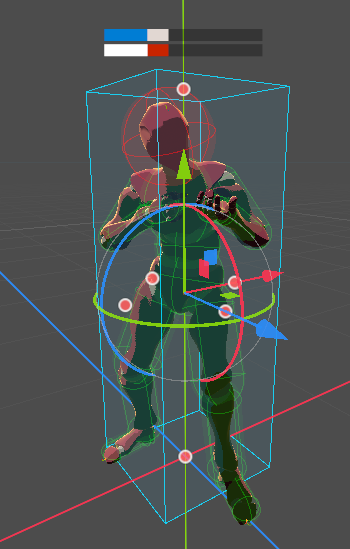
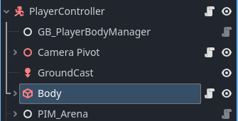

/[scripts](../../../..)/[engine_tools](../../..)/[physics](../..)/[bodies](..)/objects

---

This folder contains tools used to simplify and normalize physics bodies manipulations. 

- [Body Scale](#body-scale)
  - [Brief reminder - Environmental hitboxes/Collision Boxes](#brief-reminder---environmental-hitboxescollision-boxes)
    - [Design choice](#design-choice)
  - [Box constraint](#box-constraint)
  - [Usage](#usage)
    - [SpatialAnchor](#spatialanchor)
    - [PhysicsBody](#physicsbody)
    - [BodyHitBox](#bodyhitbox)
  - [Thorough Documentation](#thorough-documentation)
    - [Initial Scale](#initial-scale)
    - [SetTargetScale](#settargetscale)
    - [ResetScale](#resetscale)


# [Body Scale](PHX_BodyScale.cs)

This Node is a Wrapper of `CollisionShape3D`, and allows to safely change the scale of it.  
It is mostly intended for environmental hitboxes which is the simplified hitbox of an entity used to check collisions with the environment.

> ⚠️ It would benefit a rework to handle in a more generic way models and damage hitboxes. This Node is currently quite ad-hoc to the current player architecture.

## Brief reminder - Environmental hitboxes/Collision Boxes

Each entity has an environmental hitbox, which is used to interact with the environment and handle purely physics collisions, like ground, walls, other entities etc. (i.e., anything that lies on the first collision layer mask)  
Since we don't need a shape as precise as for damage hits, and that it will be used much more intensively (- every physics ticks, and for more complex operations), using a simpler hitbox frees a lot of unecessary computing.  

### Design choice

The current design is a simple Box that cannot rotate. You might wonder why not a capsule, as it is much more common in modern games. The reason why capsule is used is notably for its smooth edges, which allows to get away with small impurities that the player could get stuck on. But relying on the *smoothness of the hitbox shape* to hide this kind of problems is pretty lazy, and could lead in unexpected behaviors, especially in a game where movement is that important.  
We would rather use a box, which's shape results in more consistent behavior, and clearly define routines to get around such situations.

Freezing its Y rotation avoids weird interactions where the player could push himself by turning around.

  
<small>In blue is the collision box, in green and red are damage hitboxes</small>

## Box constraint

Since the Body Scale Node is intended to be used for environmental hitboxes, until now, it expects the `CollisionShape3D`'s Shape to be a box, this will not work with other shapes since all shapes don't express their dimension in the same way. One might not even define a "height", "length" at all. We would need an explicit interpretation for each shape, which is unecessary work as this node will be only used with boxes.

## Usage

First, simply use this Node instead of a regular `CollisionShape3D` for the collision of the entitie's controller.  



### SpatialAnchor

It is the parent node of some spatial elements that should be scaled with the collision box. For example, if you have a simple mesh model that can directly be scaled, or some raycasts to detect feet and head level, they should be the child of an anchor node that can then be scaled accordingly.

### PhysicsBody

The parent ``PhysicsBody3D`` of this ``CollisionShape3D``. Used for physics run-time checks.

### BodyHitBox
> ⚠️ To be deprecated  

The damage hit box of the player. This node should later not be specific to player, and handle damage hitbox scaling as an animation transition rather than an actual scale of some collision shape. 

## Thorough Documentation

### Initial Scale

The initial scale is the scale the objects (spatial anchor, collision box & hitbox) were at on Ready().

### SetTargetScale
```cs
public void SetTargetScale(float targetScaleRatio, float scaleSpeed);
```

Sets the new target scale, and how fast it should be reached.
- **targetScaleRatio** is a ratio from initial scale. 2 means twice as big, 0.5 means half the size.
- **scaleSpeed** is not a very concrete metric. Simply put, the higher it is, the faster the targetScaleRatio will be reached.


### ResetScale
```cs
public void ResetScale(float scaleSpeed);
```

Sets back the scale of the objects to their [initial scale](#initial-scale).
- **scaleSpeed** is not a very concrete metric. Simply put, the higher it is, the faster the targetScaleRatio will be reached.


